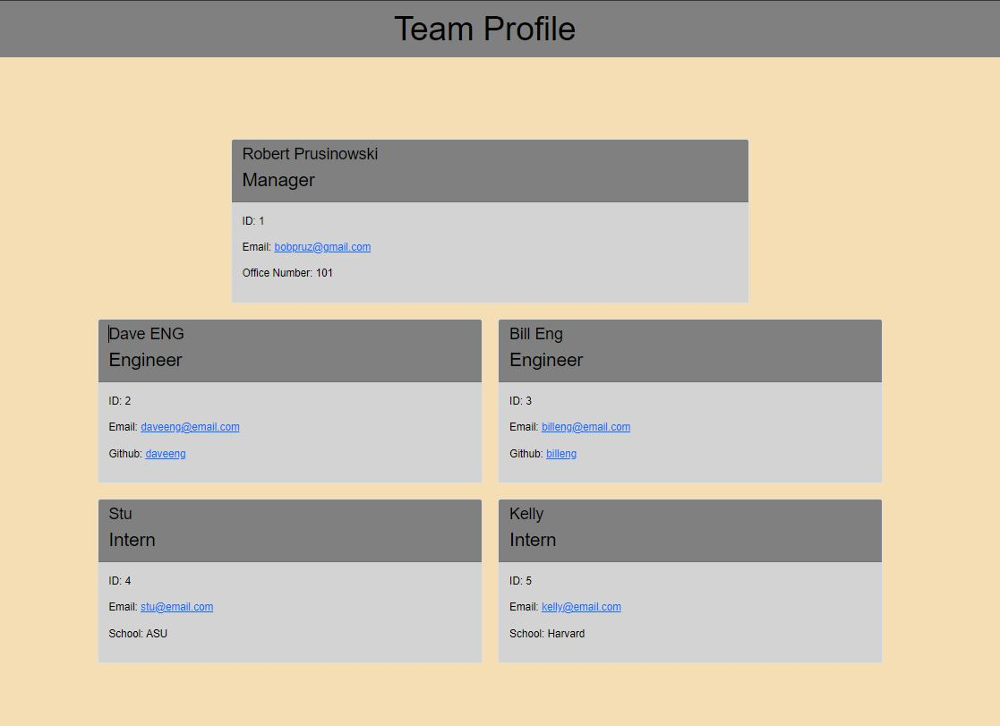

# Team Portfolio Generator

 ## License

  

  ## Description

  This is a command-line application that dynamically generates a team org chart file from a user's input using the Inquirer package.

  ## Built With

  JavaScript, Node, NPM

  ## Website

  https://github.com/bobpruz/team-portfolio-generator

  ## Maintainer

  <a href="mailto:bobpruz@gmail.com">Email: Robert Prusinowski</a>
  
  ## Video Link
  
  https://drive.google.com/file/d/1dQvtRtDNqscJgxKZfwGEg3LeH19KFyyJ/view?usp=sharing

  ## Screenshot

  
